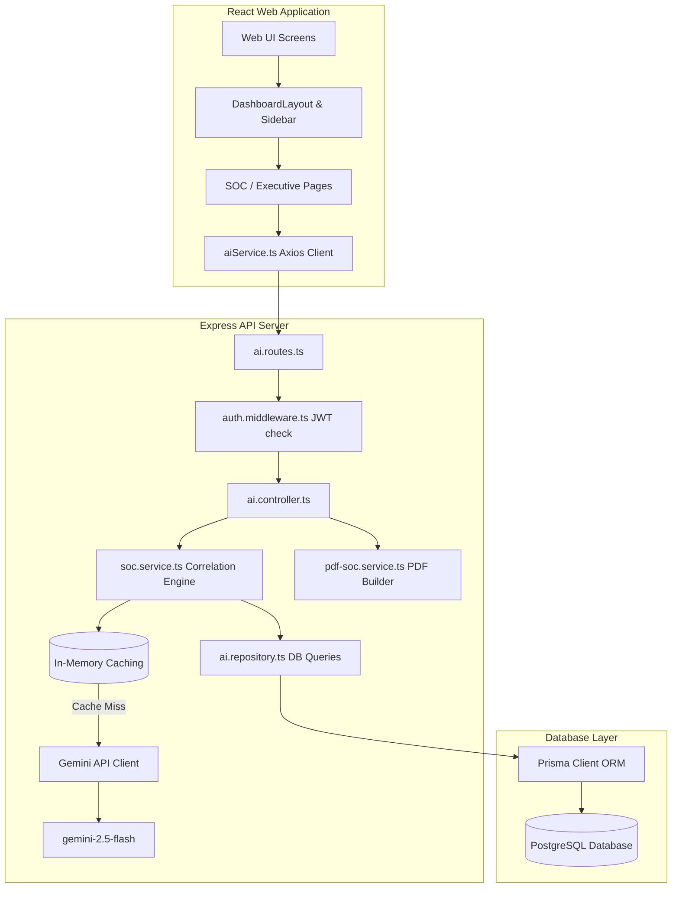

# Architecture & Technical Audit Summary — SentinelX AI

This document provides a comprehensive structural audit of the SentinelX AI platform. It highlights design patterns, data flow, component layout, and structural grade ratings.

---

## 1. Directory Structure

```
SentinelX-AI/
├── backend/
│   ├── prisma/
│   │   └── schema.prisma           # Prisma DB schema definitions
│   └── src/
│       ├── app.ts                  # Express App configuration
│       ├── server.ts               # Listen port execution wrapper
│       ├── auth/                   # Authentication controller, route, and middleware
│       ├── assets/                 # Asset models, repositories, and routes
│       ├── scans/                  # XML parser and Scan registries
│       ├── ports/                  # Opened Port and risk definitions
│       ├── vulnerabilities/        # Vulnerability registers
│       └── ai/                     # AI Engine
│           ├── controllers/        # AI endpoint handlers
│           ├── repositories/       # Context aggregation repositories
│           ├── routes/             # Path routing declarations
│           └── services/           # Gemini client integrations and PDF generation
└── frontend/
    └── src/
        ├── layouts/
        │   └── DashboardLayout.tsx # Sidebar layout configuration
        ├── services/
        │   ├── api.ts              # Global Axios base setup
        │   └── aiService.ts        # AI API binding methods
        ├── types/
        │   └── ai.ts               # Core model interfaces
        └── pages/
            ├── auth/               # Access authentication UI
            ├── dashboard/          # Assets, Scans, and Port management UI
            └── ai/                 # Cyber SOC interfaces
                ├── ExecutiveReportPage.tsx
                ├── SecurityGraphsPage.tsx
                ├── MitrePatchPage.tsx
                ├── IncidentResponsePage.tsx
                └── ChatPage.tsx
```

---

## 2. Technical System Architecture



---

## 3. Core Structural Patterns
1. **Repository Pattern:** Separates db operations from business services. `ai.repository.ts` collects user statistics across hosts, ports, vulnerabilities, and scans safely.
2. **Controller-Service Layer Separation:** Routes bind strictly to Controller actions. Controllers parse Express request scopes and pass IDs to services. Business logic, prompt engineering, and PDF compilation are cleanly isolated in Service objects.
3. **Caching Layer:** Due to severe rate limiting on the Google Gemini API (returning 503 Service Unavailable), the `SocService` incorporates stats-based signature caching. If assets/vulnerability states do not change, consecutive requests retrieve responses in milliseconds without querying Gemini.
4. **Custom Visualization Engine:** Avoids dependency-hell with React 19 by constructing custom SVG rendering engines for graphs and dashboards.
