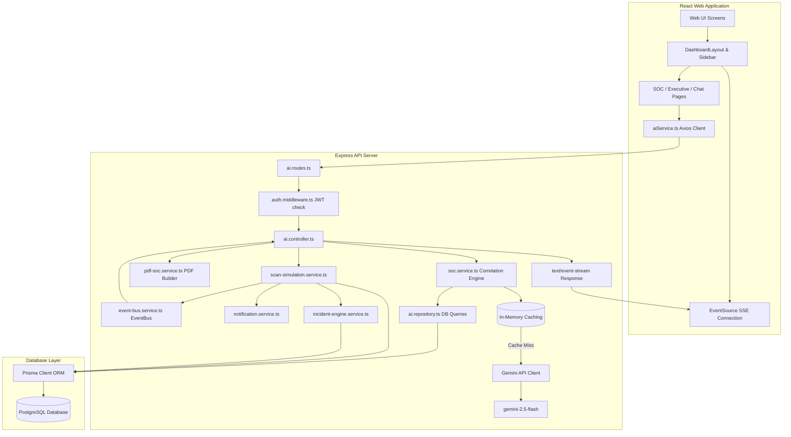

# SentinelX AI — System Architecture Diagram

```mermaid
graph TD
  subgraph Frontend [React Web Application]
    UI[Web UI Screens] --> Layout[DashboardLayout & Sidebar]
    Layout --> Pages[SOC / Executive / Chat Pages]
    Pages --> Service[aiService.ts Axios Client]
    Layout --> SSEClient[EventSource SSE Connection]
  end

  subgraph Backend [Express API Server]
    Service --> Router[ai.routes.ts]
    Router --> Auth[auth.middleware.ts JWT check]
    Auth --> Ctrl[ai.controller.ts]
    
    Ctrl --> SocServ[soc.service.ts Correlation Engine]
    Ctrl --> PDF[pdf-soc.service.ts PDF Builder]
    Ctrl --> ScanSim[scan-simulation.service.ts]
    
    ScanSim --> EventBus[event-bus.service.ts EventBus]
    ScanSim --> Notify[notification.service.ts]
    ScanSim --> IncidentEng[incident-engine.service.ts]
    
    EventBus --> Ctrl
    Ctrl --> SSEServer[text/event-stream Response]
    SSEServer --> SSEClient
    
    SocServ --> Cache[(In-Memory Caching)]
    SocServ --> Repos[ai.repository.ts DB Queries]
    
    Cache -- Cache Miss --> Gemini[Gemini API Client]
    Gemini --> GeminiModel["gemini-2.5-flash"]
  end

  subgraph Persistence [Database Layer]
    Repos --> Prisma[Prisma Client ORM]
    Prisma --> PG[(PostgreSQL Database)]
    ScanSim --> Prisma
    IncidentEng --> Prisma
  end
```
